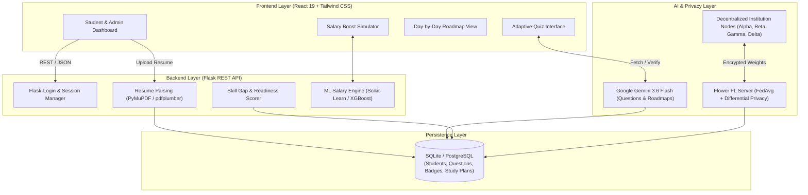

# 🚀 SkillBridge: Privacy-Preserving Career Intelligence & Skill Gap Analysis

[](https://python.org)
[](https://react.dev)
[](https://flask.palletsprojects.com/)
[](https://ai.google.dev/)
[](https://flower.ai/)
[](https://en.wikipedia.org/wiki/Differential_privacy)
[](LICENSE)

> **A decentralized, AI-driven career development platform that bridges the gap between student competencies and industry requirements through adaptive verification, predictive salary modeling, and privacy-preserving federated intelligence.**

---

## 📌 Table of Contents
- [Problem Statement](#-problem-statement)
- [What Makes SkillBridge Different?](#-what-makes-skillbridge-different)
- [Key Features](#-key-features)
- [System Architecture](#-system-architecture)
- [Technology Stack](#-technology-stack)
- [Project Directory Structure](#-project-directory-structure)
- [Installation & Local Setup](#-installation--local-setup)
- [Environment Configuration](#-environment-configuration)
- [REST API Reference](#-rest-api-reference)
- [Future Scope (Phase 2)](#-future-scope-phase-2)

---

## ⚠️ Problem Statement

1. **Resume Keyword Inflation**: Traditional applicant tracking systems (ATS) and hiring platforms rely on *self-reported* keywords or unverified online certificates. Anyone can write "Python" or "Machine Learning" on a resume without true competency.
2. **Fragmented Career Preparation**: Students navigate disconnected tools—resumes on Word, testing on HackerRank, courses on YouTube/Coursera, and salary guesses on Glassdoor—without an integrated feedback loop.
3. **Data Sovereignty & Privacy Concerns**: Universities and training institutions cannot easily share student placement records and academic benchmarks due to strict privacy regulations (GDPR, FERPA), preventing cross-institutional collaborative intelligence.

---

## 💡 What Makes SkillBridge Different?

| Feature | Existing Platforms (LinkedIn, Coursera, ATS) | SkillBridge |
| :--- | :--- | :--- |
| **Skill Validation** | Self-reported keywords or passive video completion certificates | **Active Verification Loop**: Only skills verified via dynamic AI quizzes count toward career readiness. |
| **Data Privacy** | Centralized database storing raw student resumes and sensitive grades | **Federated Learning + Differential Privacy ($\epsilon = 0.9, \delta = 10^{-5}$)**: Data never leaves local campus servers. |
| **Curriculum Planning** | Generic, static 40-hour course recommendations | **Dynamic Day-by-Day AI Roadmaps** with exact time allocations and curated free resources. |
| **Financial Motivation** | Vague suggestions ("Cloud is in demand") | **Quantifiable ML Salary Boost**: Simulates exact projected LPA increase from target skill acquisitions. |

---

## ✨ Key Features

- 📄 **Intelligent Resume Parsing**: Automatically extracts technical skills, years of experience, and contact info from PDF and DOCX files using **PyMuPDF**, **pdfplumber**, and natural language processing.
- 🧠 **Adaptive AI Verification Engine**: Powered by **Google Gemini 3.6 Flash**. Generates on-the-fly technical MCQs tailored to candidate confidence levels and caches permanent questions in a local SQLite question bank.
- 🎯 **Target Career Gap Analysis**: Computes real-time coverage scores against curated and dynamically generated industry roles (*Data Analyst, Data Scientist, Software Engineer, Full Stack Developer, DevOps Engineer*).
- 🗺️ **Personalized Daily Roadmap**: Day-by-day learning schedule targeting only the missing skills, complete with descriptions, study hour estimations, and direct YouTube search links.
- 💰 **ML Salary Predictor & Boost Simulator**: Uses **Scikit-Learn / XGBoost** to predict current market compensation and calculate return on investment (ROI) for learning new technologies (e.g., adding Docker + AWS).
- 🏆 **Gamified Progress Tracking**: Dynamic readiness gauges (0–100%), historical snapshot timelines, and automated milestone badges (*Profile Kickoff, High Ready, Quiz Master*).
- 🛡️ **Privacy-Preserving Federated Learning**: Implements multi-node institutional training rounds (*Alpha, Beta, Gamma, Delta*) using **Flower (`flwr`)** and **Federated Averaging (FedAvg)** with noise injection for Differential Privacy.
- 📊 **Administrative Oversight Portal**: High-level platform analytics tracking institution-wide readiness averages, common skill gaps, and round-by-round federated training performance.

---

## 🏛️ System Architecture



---

## 💻 Technology Stack

### Frontend
- **React 19** (Single Page Application)
- **React Router DOM v7** (Client-side routing & protected routes)
- **Tailwind CSS v3** (Modern responsive dark-mode styling & glassmorphism)
- **Chart.js & react-chartjs-2** (Radar charts, score gauges & salary graphs)
- **React Icons (`react-icons/tb`)** (Tabler icon library)
- **Axios** (Session-backed HTTP client)

### Backend
- **Python 3.11+ / 3.12**
- **Flask** (Modular RESTful API design using Blueprints)
- **Flask-Login** (Cookie-based session security)
- **Flask-SQLAlchemy / SQLAlchemy 2.0** (ORM)
- **Flask-CORS** (Credentialed cross-origin sharing)
- **SQLite / PostgreSQL** (Relational storage)

### Generative AI & Machine Learning
- **Google GenAI SDK (`google-genai`)** & **Gemini 3.6 Flash** (Dynamic Quiz & Curriculum Generation)
- **Scikit-Learn & XGBoost** (Salary regression & boost projection)
- **Flower (`flwr`)** (Federated Learning framework)
- **PyMuPDF (`fitz`)**, **pdfplumber**, **python-docx** (Document processing)

---

## 📁 Project Directory Structure

```text
skillbridge/
├── backend/
│   ├── app.py                      # Flask Application entrypoint & Blueprint registry
│   ├── extensions.py               # Shared DB and LoginManager extensions
│   ├── models.py                   # SQLAlchemy Database models
│   ├── requirements.txt            # Python dependencies
│   ├── data/
│   │   ├── career_requirements.py  # Curated skill profiles (Data Analyst, SDE, etc.)
│   │   └── salary_data.csv         # Baseline training data for salary models
│   ├── federated/
│   │   ├── client.py               # FL Node client partition logic
│   │   └── server.py               # Flower FedAvg server & Differential Privacy
│   ├── ml/
│   │   ├── salary_model.py         # XGBoost / Scikit-Learn salary regression
│   │   ├── skill_gap_model.py      # Mathematical competency distance model
│   │   └── readiness_model.py      # Weighted career readiness scorer
│   ├── routes/
│   │   ├── auth.py                 # Registration, login, session validation
│   │   ├── student.py              # Resume, quizzes, gaps, roadmaps, salary
│   │   └── admin.py                # Platform analytics & FL round triggering
│   └── utils/
│       ├── ai_question_generator.py # Gemini 3.6 Flash MCQ generator
│       ├── roadmap_generator.py     # Gemini roadmap curriculum engine
│       ├── question_bank_manager.py # Automatic question top-up & deduplication
│       └── progress_tracker.py      # Historical snapshot & timeline recorder
├── frontend/
│   ├── package.json                # React dependencies and scripts
│   ├── tailwind.config.js          # Custom theme and palette configuration
│   └── src/
│       ├── components/             # Reusable UI cards, sidebars, charts, layout
│       ├── pages/                  # Dashboard, SkillGap, Roadmap, Assessments, etc.
│       └── services/               # Axios API wrappers (authService, skillService)
├── .vscode/
│   └── settings.json               # IDE workspace Python interpreter configuration
├── pyrightconfig.json              # Pyright / Pylance environment resolution
└── README.md                       # Comprehensive project documentation
```

---

## 🛠️ Installation & Local Setup

### Prerequisites
- **Node.js** (v18 or higher) & **npm**
- **Python** (v3.10 to v3.13)
- **Git**

### 1. Clone the Repository
```bash
git clone https://github.com/AYSHA-GITT/skillbridge.git
cd skillbridge
```

### 2. Backend Setup
```powershell
# Create and activate Python virtual environment
python -m venv .venv
.venv\Scripts\activate   # On Windows (or 'source .venv/bin/activate' on macOS/Linux)

# Install dependencies
cd backend
pip install -r requirements.txt

# Run database setup (automatically creates tables on launch)
python app.py
```
*The backend server will run on `http://127.0.0.1:5000`.*

### 3. Frontend Setup
Open a second terminal window:
```powershell
cd skillbridge/frontend

# Install dependencies
npm install

# Start development server
npm start
```
*The application will automatically open in your browser at `http://localhost:3000`.*

---

## ⚙️ Environment Configuration

Create a `.env` file in the `backend/` folder:

```env
DATABASE_URL=sqlite:///skillbridge.db
SECRET_KEY=skillbridge_super_secret_key_2026
GEMINI_API_KEY=your_google_gemini_api_key_here
YOUTUBE_API_KEY=your_youtube_api_key_optional
```

> **Note**: Obtain a free Gemini API key from [Google AI Studio](https://aistudio.google.com/).

---

## 📡 REST API Reference

### Authentication (`/api/auth`)
- `POST /api/auth/register` - Create a student account
- `POST /api/auth/login` - Authenticate student and initiate session
- `POST /api/auth/logout` - Invalidate current session
- `GET /api/auth/me` - Retrieve current user profile and readiness score

### Student Learning & Assessment (`/api/student`)
- `POST /api/student/upload_resume` - Upload PDF/DOCX resume file
- `GET /api/student/skills` - List verified and extracted skills
- `GET /api/student/get_quiz/<skill_id>` - Fetch adaptive MCQ assessment (dynamically created via Gemini if needed)
- `POST /api/student/submit_quiz/<skill_id>` - Submit quiz responses and verify skill
- `POST /api/student/set_target_career` - Update target career profile (*Data Analyst, SDE, etc.*)
- `POST /api/student/analyze_skill_gap` - Calculate missing required and optional skills
- `GET /api/student/get_roadmap` - Retrieve personalized day-by-day learning plan
- `POST /api/student/generate_roadmap` - Trigger AI generation of a new roadmap
- `POST /api/student/simulate_salary` - Calculate predicted salary and incremental skill boost
- `GET /api/student/badges` - Fetch unlocked gamification achievements

### Institutional Admin & Federated Learning (`/api/admin`)
- `GET /api/admin/stats` - Platform-wide statistics and common skill gaps
- `GET /api/admin/federated/rounds` - Historical logs of multi-institution training rounds
- `POST /api/admin/federated/train` - Trigger decentralized federated training round

---

## 🔮 Future Scope (Phase 2)

- 🎙️ **Live Audio Mock Interviews**: Integration with Gemini Realtime API for automated behavioral and technical interview simulations.
- ⚡ **ATS Resume Optimizer**: Instant resume scoring against pasted job descriptions with keyword alignment suggestions.
- 💼 **Direct Campus Placement Integration**: Direct API connections with hiring platforms (LinkedIn/Naukri) to enable 1-click applications based on verified readiness scores.
- ⛓️ **Soulbound Credential Badges**: Blockchain-backed digital certificates issued upon passing skill assessments.

---

## 📄 License
This project is licensed under the MIT License - see the [LICENSE](LICENSE) file for details.
